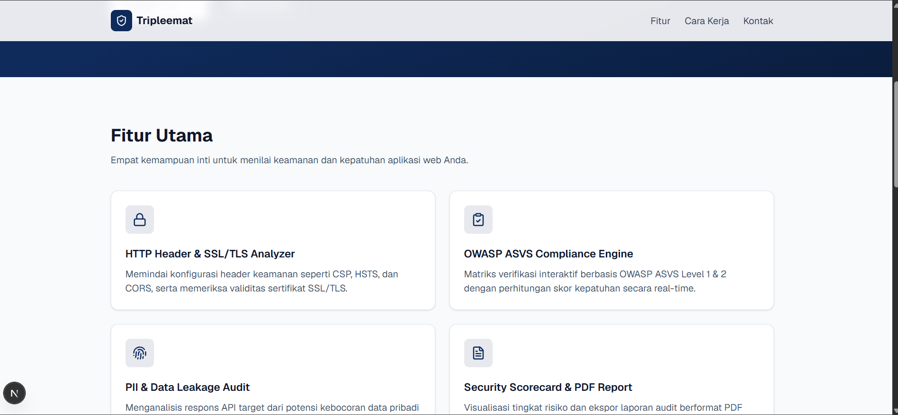
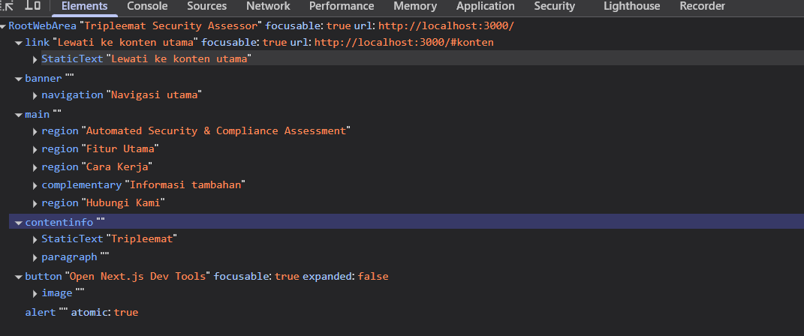
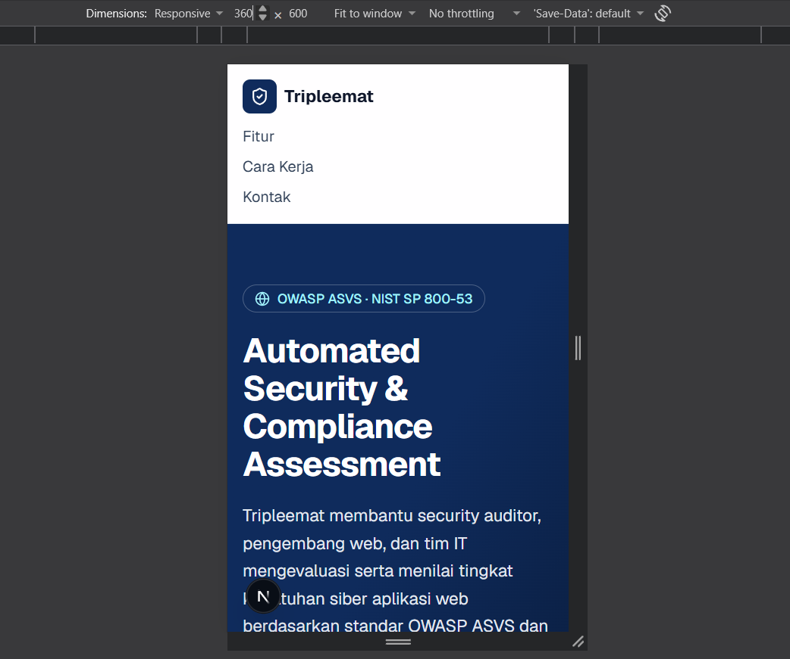
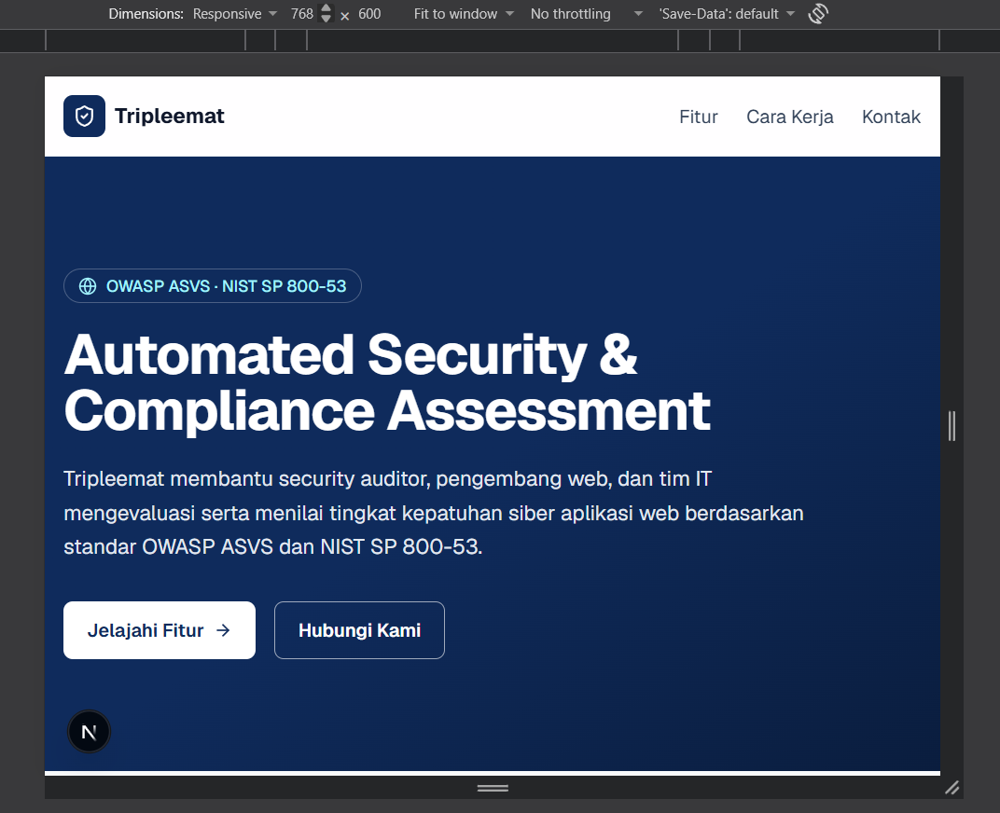
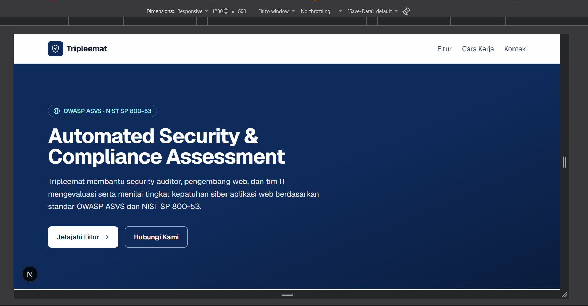
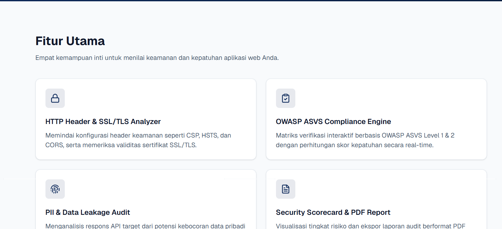
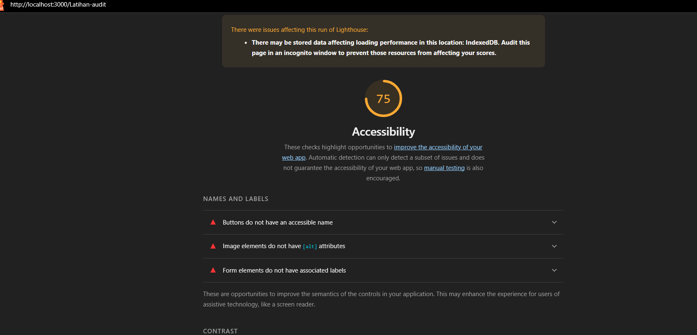

# Dokumen Teknis Modul 2 — HTML Semantik, Tailwind CSS, dan Aksesibilitas

Nama/NIM : [ISI: nama lengkap] / 105224029
Repositori : https://github.com/Naufal-strong/105224026_PrakWeb.git
Produk : Tripleemat (Security Assessor)
---

## 1. Struktur Semantik

### 1.1 Kerangka landmark dan hierarki judul halaman utama

Halaman utama Tripleemat disusun dengan elemen semantik HTML agar setiap bagian memiliki peran *landmark* yang dapat dikenali peramban dan pembaca layar. Pemetaan elemen ke peran landmark, sebagaimana tampak pada pohon aksesibilitas (Bagian 1.2), adalah sebagai berikut.

| Elemen | Peran landmark | Nama yang terbaca | Fungsi pada halaman |
| --- | --- | --- | --- |
| `<a href="#konten">` | tautan (bukan landmark) | "Lewati ke konten utama" | *Skip link* bagi pengguna papan ketik |
| `<header>` | `banner` | – | Kepala halaman berisi identitas situs |
| `<nav aria-label>` | `navigation` | "Navigasi utama" | Tautan Fitur, Cara Kerja, dan Kontak |
| `<main id="konten">` | `main` | – | Konten utama; hanya satu per halaman |
| `<section aria-labelledby>` | `region` | "Automated Security & Compliance Assessment" | Bagian pembuka (hero) |
| `<section aria-labelledby>` | `region` | "Fitur Utama" | Kartu empat fitur |
| `<section aria-labelledby>` | `region` | "Cara Kerja" | Penjelasan alur kerja |
| `<aside aria-label>` | `complementary` | "Informasi tambahan" | Informasi pendukung di samping konten |
| `<section aria-labelledby>` | `region` | "Hubungi Kami" | Formulir kontak |
| `<footer>` | `contentinfo` | – | Informasi kaki halaman ("Tripleemat") |

Hierarki judul disusun runtut tanpa melompat tingkat:

```
h1  Automated Security & Compliance Assessment
h2  Fitur Utama
      h3  (judul tiap kartu fitur)
h2  Cara Kerja
h2  Hubungi Kami
```

Hierarki ini sesuai dengan kode: `<h1 id="judul-utama">` pada bagian hero, `<h2>` pada tiap section (`judul-fitur`, `judul-cara`, `judul-kontak`), dan `<h3>` pada judul setiap kartu fitur di dalam `<article>`. Nama region pada pohon aksesibilitas berasal dari atribut `aria-labelledby` yang merujuk ke `id` judul tersebut. Bagian "Standar yang Didukung" pada aside memakai `<p>`, bukan judul, sehingga tidak mengganggu urutan tingkat judul.

Alasan pemilihan elemen:

- **`<section>` dengan `aria-labelledby`**. Elemen `<section>` baru menjadi landmark `region` apabila memiliki nama yang dapat diakses. Atribut `aria-labelledby` yang merujuk ke `id` judul (`h1`/`h2`) memberi nama tersebut tanpa menambah teks tersembunyi. Hal ini terbukti pada pohon aksesibilitas, yaitu setiap section muncul sebagai `region` dengan nama yang sesuai judulnya.
- **`<aside>` dengan `aria-label`**. Informasi tambahan bukan konten utama, sehingga dipetakan ke `complementary` dan diberi nama "Informasi tambahan" agar dapat dibedakan bila ada lebih dari satu aside.
- **`<header>` dan `<footer>` di luar `<main>`**. Kedua elemen ini hanya berperan sebagai `banner` dan `contentinfo` bila tidak berada di dalam `<article>`, `<aside>`, `<main>`, `<nav>`, atau `<section>`. Penempatannya sebagai anak langsung dari kerangka halaman memenuhi syarat tersebut.
- **Skip link**. Tautan "Lewati ke konten utama" menuju `#konten` memungkinkan pengguna papan ketik melompati navigasi. Tautan ini disembunyikan secara visual (`sr-only`) dan baru tampil saat menerima fokus.

Tampilan halaman pada desktop (bagian fitur) sebagai acuan struktur:



*Gambar 1. Header dan bagian "Fitur Utama" pada halaman utama.*

### 1.2 Tangkapan layar pohon aksesibilitas pada DevTools



*Gambar 2. Pohon aksesibilitas halaman utama (Elements → Accessibility → Enable full-page accessibility tree).*

Hasil pembacaan pohon aksesibilitas:

- Akar halaman bernama "Tripleemat Security Assessor", yang berasal dari `<title>` pada metadata.
- Terdapat tautan "Lewati ke konten utama" dengan tujuan `http://localhost:3000/#konten`.
- Landmark `banner` berisi `navigation` "Navigasi utama".
- Landmark `main` memuat empat `region` (Automated Security & Compliance Assessment, Fitur Utama, Cara Kerja, Hubungi Kami) dan satu `complementary` ("Informasi tambahan").
- Landmark `contentinfo` memuat teks "Tripleemat".
- Tombol "Open Next.js Dev Tools" dan `alert` pada bagian bawah pohon **bukan bagian dari produk**. Keduanya disisipkan Next.js hanya pada mode pengembangan (`npm run dev`) dan tidak ada pada build produksi.

**Checkpoint 1** terpenuhi: halaman memiliki satu `<main>`, setiap section bernama, serta landmark banner, navigation, main, region, complementary, dan contentinfo yang lengkap.

---

## 2. Tata Letak Responsif

### 2.1 Tangkapan layar pada lebar 360 px, 768 px, dan 1280 px



*Gambar 3. Lebar 360 px (ponsel). Logo dan tiga tautan menu tersusun ke bawah, judul hero memanjang ke beberapa baris, dan tidak muncul gulir horizontal.*



*Gambar 4. Lebar 768 px (tablet). Logo di kiri dan menu mendatar di kanan, judul hero muat dalam dua baris, dan dua tombol aksi berdampingan.*



*Gambar 5. Lebar 1280 px (desktop). Isi header dan hero sejajar pada kolom konten bergaris tepi yang sama dan tidak melebar mengikuti layar.*

Bagian fitur pada layar lebar menampilkan kartu dalam susunan grid dua kolom:



*Gambar 6. Empat kartu fitur dalam grid dua kolom pada layar lebar.*

Pengamatan dari ketiga tangkapan layar:

| Lebar | Navigasi | Hero | Gulir horizontal |
| --- | --- | --- | --- |
| 360 px | Bertumpuk (logo, lalu menu ke bawah) | Judul empat baris; tombol aksi berada di bawah lipatan | Tidak ada |
| 768 px | Mendatar (logo kiri, menu kanan) | Judul dua baris; dua tombol berdampingan | Tidak ada |
| 1280 px | Mendatar, dibatasi lebar maksimum | Teks hero dibatasi lebarnya agar nyaman dibaca | Tidak ada |

### 2.2 Kelas Flexbox, Grid, dan breakpoint yang digunakan beserta alasannya

Kelas pada tabel berikut diambil langsung dari `app/page.tsx`.

| Bagian | Kelas yang digunakan | Alasan pemilihan |
| --- | --- | --- |
| Navigasi (`<nav>`) | `mx-auto flex max-w-6xl flex-col gap-3 p-4 sm:flex-row sm:items-center sm:justify-between` | Flexbox menata elemen dalam **satu dimensi**. Tanpa awalan (ponsel), `flex-col` menumpuk logo dan menu dengan jarak `gap-3`. Mulai `sm` (640 px), `flex-row` mensejajarkan keduanya, `justify-between` mendorong logo ke kiri dan menu ke kanan, dan `items-center` meratakan keduanya pada sumbu silang. Hasilnya sesuai Gambar 3 (bertumpuk) dan Gambar 4 (mendatar). |
| Daftar menu (`<ul>`) | `flex flex-col gap-2 sm:flex-row sm:items-center sm:gap-6` | Tautan bertumpuk dengan jarak kecil di ponsel agar mudah disentuh, lalu mendatar dengan jarak lebih lebar (`gap-6`) mulai `sm`. |
| Logo dan nama (`<Link>`) | `flex items-center gap-2` | Flexbox kecil untuk meratakan ikon perisai dan teks "Tripleemat" secara vertikal. |
| Pembatas konten | `mx-auto max-w-6xl px-4` | `max-w-6xl` (72rem atau 1152 px) membatasi lebar dan `mx-auto` memusatkan konten, sehingga pada 1280 px teks tidak melebar sampai tepi layar (Gambar 5). Dipakai di header, hero, fitur, cara kerja, kontak, dan footer agar tepi kiri seluruh bagian sejajar. |
| Hero: judul | `text-4xl sm:text-5xl` dan `max-w-3xl` | Ukuran huruf mengikuti pendekatan mobile-first: `text-4xl` di ponsel, `text-5xl` mulai 640 px. `max-w-3xl` membatasi panjang baris agar tetap nyaman dibaca. |
| Hero: tombol aksi | `flex flex-wrap gap-4` | `flex-wrap` memindahkan tombol ke baris baru bila ruang tidak cukup, sehingga tidak perlu awalan breakpoint dan tidak memunculkan gulir horizontal pada 360 px. |
| Hero: jarak vertikal | `py-16 sm:py-24` | Jarak atas-bawah lebih rapat di ponsel dan lebih lega mulai 640 px. |
| Kartu fitur (`<ul>`) | `mt-10 grid grid-cols-1 gap-6 sm:grid-cols-2` | Grid menata **dua dimensi** (baris dan kolom), cocok untuk kumpulan kartu. Satu kolom pada ponsel, dua kolom mulai 640 px. Karena fiturnya empat, dua kolom menghasilkan susunan 2×2 yang seimbang (Gambar 6). Kelas `lg:grid-cols-3` pada contoh modul sengaja tidak dipakai karena tiga kolom akan menyisakan satu kartu sendirian di baris kedua. |
| Tinggi kartu seragam | `h-full` pada `<article>` di dalam `<li>` | Kartu dalam satu baris grid memiliki tinggi sama sehingga tampilan rapi. |
| Cara Kerja dan aside | `grid gap-10 lg:grid-cols-[2fr_1fr]` | Nilai sembarang (*arbitrary value*) membuat kolom "Cara Kerja" dua kali lebih lebar daripada aside. Awalan `lg:` menjaga keduanya bertumpuk di bawah 1024 px dan berdampingan mulai 1024 px. |
| Daftar langkah | `flex gap-4` dengan `shrink-0` pada lingkaran nomor | Flexbox menjajarkan lingkaran nomor dan teks. `shrink-0` mencegah lingkaran gepeng ketika teks panjang. |
| Formulir | `grid max-w-xl gap-4` dan `flex flex-col gap-1` pada tiap kolom | Grid satu kolom dengan lebar maksimum `max-w-xl` menjaga formulir tidak terlalu lebar. Setiap pasangan label dan isian ditumpuk dengan Flexbox. |
| Footer | `flex flex-col gap-4 sm:flex-row sm:items-center sm:justify-between` | Pola yang sama dengan navigasi: bertumpuk di ponsel, mendatar mulai 640 px. |

Warna merek didefinisikan pada blok `@theme` di `app/globals.css` (`--color-brand: #0f2b5c`, `--color-brand-dark: #0a1d3e`, `--color-brand-light: #1e4a8a`), sehingga dapat dipakai sebagai kelas `bg-brand`, `text-brand`, `bg-brand-dark`, dan `focus-visible:outline-brand`.

Alasan umum pemilihan **Flexbox** untuk navigasi dan **Grid** untuk kartu serta tata letak halaman: navigasi hanya membutuhkan satu arah sumbu (sebaris atau sekolom), sedangkan kartu fitur dan pasangan konten–aside membutuhkan pengaturan baris dan kolom sekaligus.

Breakpoint yang dipakai mengikuti nilai bawaan Tailwind CSS v4: `sm` 640 px, `md` 768 px, `lg` 1024 px, dan `xl` 1280 px. Ketiga ukuran uji (360, 768, 1280 px) masing-masing mewakili ponsel (di bawah `sm`), tablet (`md`), dan desktop (`xl`).

**Checkpoint 2 dan 3**: navigasi berubah dari bertumpuk ke mendatar sesuai breakpoint, kartu fitur tersusun dalam grid, dan tidak ada gulir horizontal pada ketiga lebar layar.

---

## 3. Audit Aksesibilitas

### 3.1 Tabel skor Lighthouse sebelum dan sesudah perbaikan

Pengaturan audit: mode *Navigation*, perangkat *Mobile*, kategori *Accessibility*, dijalankan pada jendela Incognito/InPrivate agar ekstensi peramban tidak memengaruhi hasil.

| Halaman | Skor sebelum | Skor sesudah | Target |
| --- | --- | --- | --- |
| Halaman latihan (`/Latihan-audit`) | 75 | [ISI] | minimal 90 |
| Halaman utama (`/`) | [ISI] | [ISI] | minimal 85 |



*Gambar 7. Laporan Lighthouse halaman latihan sebelum perbaikan. Skor aksesibilitas 75, dengan audit gagal "Buttons do not have an accessible name", "Image elements do not have [alt] attributes", dan "Form elements do not have associated labels".*

### 3.2 Daftar audit yang gagal, penyebab, dan perbaikannya

Halaman latihan (`app/Latihan-audit/page.tsx`) sengaja memuat masalah aksesibilitas. Kode awalnya identik dengan contoh pada modul, sehingga temuan berikut dapat ditelusuri langsung ke barisnya. **[ISI]** Cocokkan dengan laporan Lighthouse Anda sendiri dan hapus atau tambahkan baris sesuai hasil sebenarnya.

| Audit yang gagal | Penyebab pada kode | Perbaikan |
| --- | --- | --- |
| *Image elements do not have [alt] attributes* | `` tanpa atribut `alt`. | Tambahkan `alt` yang menjelaskan isi gambar, atau `alt=""` bila gambar hanya dekoratif. |
| *Background and foreground colors do not have a sufficient contrast ratio* | `text-gray-300` pada latar putih, rasionya di bawah 4,5:1 (WCAG 1.4.3). | Ganti dengan `text-gray-700` yang lebih gelap. |
| *Form elements do not have associated labels* | `<input type="search">` tidak memiliki `<label>`. | Tambahkan `<label htmlFor>` yang terlihat, mis. "Cari alat", dan beri `id` pada input. |
| *Buttons do not have an accessible name* | Tombol hanya berisi ikon SVG, tanpa teks. | Tambahkan `aria-label="Cari"` pada tombol dan `aria-hidden="true"` pada SVG. |

Temuan tambahan yang **tidak** ditandai gagal oleh Lighthouse, tetapi terlihat pada pemeriksaan manual:

- Judul halaman ditulis dengan `<div>`. Perbaikannya diganti menjadi `<h1>` agar struktur judul dikenali pembaca layar.
- Penggunaan *placeholder* sebagai pengganti label. Alat audit otomatis dapat menerima placeholder sebagai nama kolom, tetapi teksnya hilang saat pengguna mulai mengetik dan sering berkontras rendah, sehingga label yang terlihat tetap diperlukan.

**Kode halaman latihan setelah perbaikan** (perubahan dibandingkan kode awal: baris 4 sampai 12):

```tsx
export default function LatihanAudit() {
  return (
    <div className="p-8">
      <h1 className="text-2xl font-bold">Katalog Alat Laboratorium</h1>
      
      <p className="text-gray-700">Stok diperbarui setiap hari.</p>
      <label htmlFor="cari" className="block font-medium">Cari alat</label>
      <input id="cari" type="search" className="border p-2" />
      <button aria-label="Cari" className="ml-2 border p-2">
        <svg aria-hidden="true" width="16" height="16" viewBox="0 0 16 16">
          <circle cx="7" cy="7" r="5" stroke="currentColor" fill="none" />
        </svg>
      </button>
    </div>
  );
}
```

Alasan tiap perubahan:

- `alt=""` dipilih untuk `next.svg` karena gambar tersebut hanya logo hiasan dan tidak membawa informasi bagi katalog. Gambar informatif memerlukan `alt` deskriptif (WCAG 1.1.1).
- `text-gray-700` memberi rasio kontras sekitar 10,31:1 terhadap latar putih, sedangkan `text-gray-300` sebelumnya hanya sekitar 1,47:1 dan jauh di bawah syarat 4,5:1 (WCAG 1.4.3).
- `<label htmlFor="cari">` dihubungkan ke `id="cari"` sehingga kolom pencarian memiliki nama yang dapat diakses dan mengeklik label memindahkan fokus ke kolom (WCAG 1.3.1 dan 4.1.2).
- `aria-label="Cari"` memberi nama pada tombol ikon, sedangkan `aria-hidden="true"` pada SVG mencegah pembaca layar membaca ikon yang tidak bermakna (WCAG 4.1.2).
- `<h1>` menggantikan `<div>` agar judul halaman dikenali sebagai judul pada pohon aksesibilitas (WCAG 1.3.1).

**Halaman utama (`/`).** Hasil tinjauan kode `app/page.tsx` terhadap kriteria pada Tabel 2 modul:

| Kriteria WCAG 2.2 | Kondisi pada halaman utama |
| --- | --- |
| 1.1.1 Konten Nonteks | Halaman tidak memakai ``. Seluruh ikon dari `lucide-react` (perisai, kunci, sidik jari, panah, dan lainnya) dekoratif dan diberi `aria-hidden="true"`. |
| 1.3.1 Informasi dan Relasi | Landmark lengkap, `h1` tunggal, `h2` per section, `h3` per kartu, dan setiap kolom formulir memiliki `<label htmlFor>`. Pilihan radio dikelompokkan dengan `<fieldset>` dan `<legend>Peran</legend>`. |
| 1.4.3 Kontras Minimum | Pasangan warna yang dipakai seluruhnya jauh di atas 4,5:1, lihat tabel kontras di bawah. |
| 2.1.1 Papan Ketik | Semua elemen interaktif adalah `<a>`, `<button>`, `<input>`, atau `<textarea>` asli, bukan `<div>` yang dapat diklik. |
| 2.4.7 Fokus Terlihat | Tautan menu, tombol hero, kolom isian, dan tombol Kirim memakai `focus-visible:outline-2 focus-visible:outline-offset-2` dengan warna kontras. Tautan "Lewati ke konten utama" tampil saat fokus. |
| 4.1.2 Nama, Peran, Nilai | Tautan logo bernama "Tripleemat" dan setiap tautan berisi teks. Tidak ada tombol yang hanya berisi ikon. |

Rasio kontras pasangan warna utama (dihitung dengan rumus luminans relatif WCAG):

| Pasangan teks dan latar | Rasio |
| --- | --- |
| Putih pada `brand` (#0f2b5c): judul hero, tombol Kirim, lingkaran nomor | 13,81:1 |
| `cyan-200` pada `brand`: lencana "OWASP ASVS · NIST SP 800-53" | 11,07:1 |
| `slate-200` pada `brand-dark` (#0a1d3e): paragraf hero pada ujung gradien terpekat | 13,54:1 |
| `slate-700` pada putih: tautan menu | 10,35:1 |
| `slate-600` pada `slate-50`: deskripsi section | 7,24:1 |
| `slate-600` pada putih: deskripsi kartu | 7,58:1 |
| `slate-300` pada `brand-dark`: teks footer | 11,24:1 |

Berdasarkan tinjauan kode, tidak ada pelanggaran yang tampak pada halaman utama. Hal ini **belum menggantikan audit Lighthouse**: skor sebenarnya tetap harus diukur dan dicatat pada tabel 3.1.

### 3.3 Hasil pemeriksaan manual dengan papan ketik (urutan fokus dan garis fokus)

| Pemeriksaan | Hasil |
| --- | --- |
| Tab pertama langsung menyorot tautan "Lewati ke konten utama" dan menampilkannya | [ISI: ya/tidak] |
| Urutan fokus yang diharapkan dari struktur kode: skip link → logo → Fitur → Cara Kerja → Kontak → "Jelajahi Fitur" → "Hubungi Kami" → Nama lengkap → Surel → pilihan Peran (satu pemberhentian Tab untuk seluruh grup radio, panah mengganti pilihan) → Pesan → Kirim | [ISI: sesuai/tidak] |
| Urutan fokus mengikuti urutan visual | [ISI] |
| Garis fokus terlihat jelas pada setiap elemen interaktif | [ISI] |
| Radio pilihan peran dapat dipilih dengan Spasi, formulir dikirim dengan Enter | [ISI] |

---

## 4. Kendala dan Penyelesaian

- Ikon "N" bulat milik Next.js Dev Tools tampil di pojok kiri bawah dan menutupi sebagian teks pada tampilan 360 px (Gambar 3). Ikon ini hanya muncul pada mode pengembangan sehingga tidak memengaruhi produk akhir, tetapi dapat membingungkan saat membaca tangkapan layar. Elemen ini juga muncul pada pohon aksesibilitas (Gambar 2).
- Folder halaman latihan bernama `Latihan-audit` (huruf awal kapital), sedangkan modul menyebut `app/latihan-audit` dan alamat `/latihan-audit`. Rute Next.js mengikuti nama folder, dan pada sistem berkas yang membedakan huruf besar-kecil alamat `/latihan-audit` tidak akan ditemukan. Tuliskan hanya bila Anda memang mengalaminya.
- Format kendala yang disarankan: **masalah → penyebab → penyelesaian**, singkat dan disertai pesan galat bila ada.

---

## 5. Catatan Pemanfaatan AI

Alat: Claude (Anthropic).

Perintah utama: Bertanya pemahaman soal untuk mengerjakan dokumen teknis, memberikan langkah untuk ligthouse, memperbaikin code di page.tsx 

Bagian yang digunakan: kerangka dokumen, tabel pemetaan landmark, penjelasan alasan pemilihan Flexbox dan Grid, serta penjelasan penyebab dan perbaikan audit aksesibilitas.
